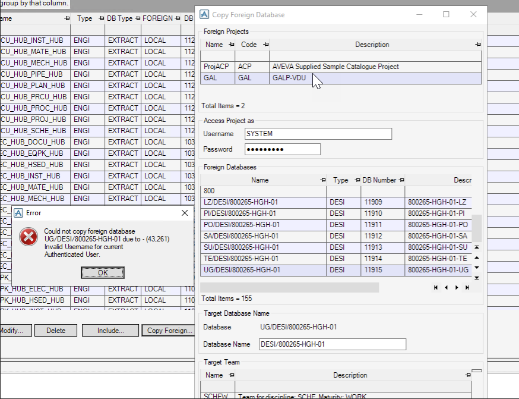
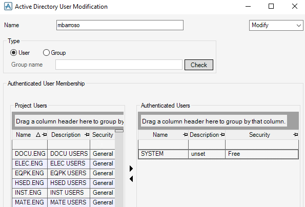

# Invalid Username For Current Authenticated User.

Tener en cuenta el **Active Directory**, revisar si existe el usuario con el que accedes al admin esta en el AD. Incluir el usuario SYSTEM (Al menos en el proyecto al que copias, aunque podria estar en los 2)

