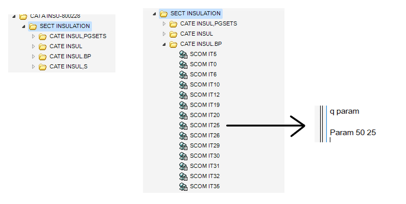
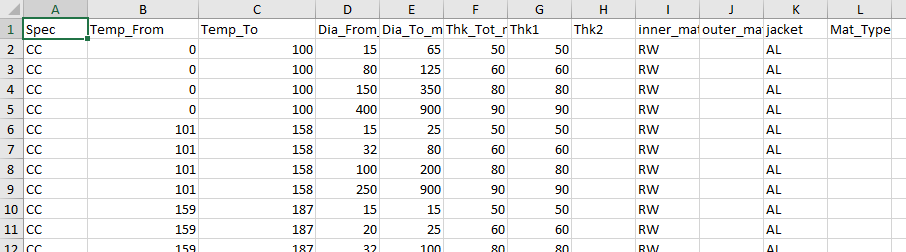
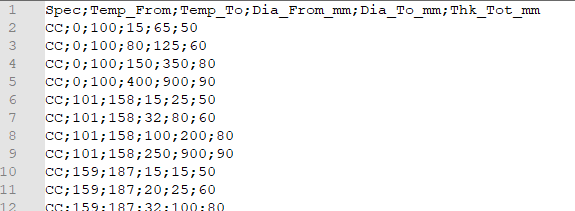
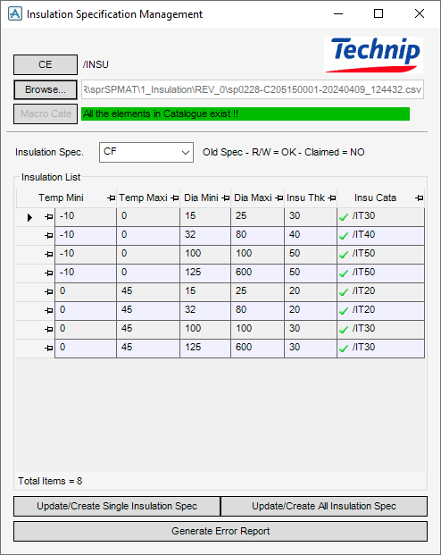
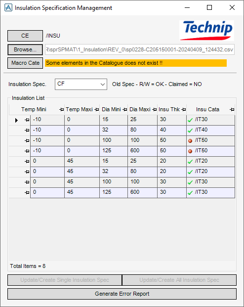

# CATALOG INSULATION

## Objetivo
El objetivo de esta KB es plasmar el procedimiento de creacion del catalogo de aislamiento y la carga de especificaciónes de aislamiento.

## Ubicación

El specs de aislamiento estan cargadas en las MDB de diseño pero no en las de Catalogo para que al cargar specs normales no caigan donde las de aislamenito.

Si queremos trabajar con las specs de de aislamiento debemos encontrar que db y cargarla en la MDB de catalogo.
Inportante despues de terminar sacar la MDB

### Como encontrar la db de insulation?

Desde diseño podems buscarla por el nombre (eje. /PP) y se abrirar en el arbol de catalogo pero dentro de E3D. Ahí podemos sacar el q dbname y q dbnumber.

Una vez ubicadas, las ponemos en la MDB de catalogo desde el Adminstrador.

Hay que estar atento a no seleccionar las de diagramas que tienen un -D en el nombre.

## Carga de Specificacion y Catalogo

Una vez dentro del catalogo con la db de insulation procederemos a carar la specificación:

Necesitaremos tener:
- Catalogo de Insulations
-  Archivo de specificación

### Catalogo Insulation:

El catalogo contiene todas las geometrias necesarias para que salgan los asilamientos.
Podemos comprovar que lo tenemos cargado correctamente llamando a los objetos /IT30 por ejemplo
                                        
De todos modos hay disponible un dblisting del catalogo de insulation completo:

[DBLISTING](./dblisitng/dblisitngCatalogInsulation.txt)

 
Primero el doble del valor del nombre, segundo el valor del nombre

### Spec de Insulation:

La specificacion debe solicitarse al departamento de materiales, se trata de un archivo xml o csv, que contiene los espesores de aislamiento en funcion de los rangos de temperatura y diametros.

Este archivo lo guardaremos en la carpeta de SPMAT del proyecto junto a los batch, con su propia carpeta 1_Insulation/Rev_0

Materiales nos envia un excel con 12 columnas en esta cas. Nosotros solo necesitamos las 6 primeras
Que nos dicen la spec los rangos de temperatura y diametros de pipes y su respectia espessor de aislamiento

Lo convertimos a un archivo .csv que solo contenga las 6 primeras columnas

A tener en cuenta:
- La spec no debe tener espacios (CCTN ; CC TN).
- Punto y coma como carácter divisor.
- Todos los valores de espesor deben tener su equivalente como objeto /ITXX.

(El formulario de carga nos advertirá de estos fallos)

Una vez listo el archivo .csv para cargar activamos el formulario de carga con: **show !!insulspec**
Devemos estar encima de un SPW para que se active.

Con el boton de browse cargamos el archivos .csv que hemos preparado anteriormente. 
Si todo es correcto nos aparecera un mensaje en verde (All the elements in the catalog exist!!).

Si hay algun error nos aparecera un menaje en naranja (Some elements in the catalog does not exist!!).

En este caso devemos comprovar si exisite el objeto que nos indica la table en rojo (/IT50)
Al ver que no existe en mi catalogo procedemos a crearlo
Nos colocamos en el objeto anterior para que quede bien ordenadao /IT46

**NEW SCOM COPY PRE NAME /IT50**

Con el objeto creado le assignamos los parametros

**PARAM 100 50**

(Primero el doble del valor y segundo el propio valor)

Importante comprovar todas las paginas de specs diferentes desde el desplegable Insulation Spec para verificar que no falte alguna en otra spec, y que ningun nombre de spec contenga espacios (CCTN ; ~~CC TN4~~).

Una vez este todo arreglado y bien puesto volvemos a cargar el csv con el boton de browse y nos deveria salir el mensaje en verde, y se nos activara el boton *Update/Create All Insulation Spec* con el que se cargaran todas las specificaciónes al proyecto.

Tambien tenemos el boton de *Update/Create Single Insulation Spec* con el que podremos cargar o actualizar una solo specificación en caso de que sea necesario o tengamos un error en una spec que no nos permita cargarla.

**SAVEWORK**

**UNCLAIM ALL**

Importante recordar sacar la DB de las specs de insulation del catalogo.

## Funcionamiento de la Insulation:

El espessor de aislaimento se assigan teniendo en cuenta dos rangos de valore:

**Diametro:** Diametro nominal de la tuberia o componente, se guarda en el atributo bore de la PIPE al crear la missma y es heredado por los brands y los brand members.
**Temperatura:** Temperatura de trabajo de la tuberia, se guarda en el atributo temp de la PIPE al crear la missma y es heredado por los brands y los brand members.
Este atributo puede ser definido manualmente por los diseñadores, pero en ocasiones es definido en enginering por otra disciplina, por lo que hay que importarlo atraves del Compere and Update.

Tambien debe estar asignado el atributo **ISPEC** (Insulation Spec) que controla especificacion de aislamiento que necesita la pipe.
 
En ocasiones sera necesario activar la visualización del aislamiento atraves de la pestaña de VIEW/SETTINGS/GRAPHICS/REPRESENTATION

