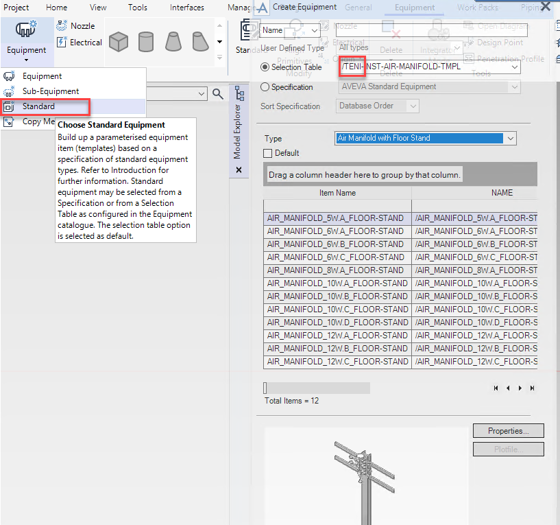

Terminología.

- **ABA-APD**: Area Based Automatic Drawing Production.

- **AREA**: El objeto área es técnicamente una IDLI que almacena las 6 coordenadas que definen un volumen volumen espacial.
  
- **BOX**: (resolver el tema BOX-VOLUM)
- **VOLUMEN**. Nos referiremos a los Volúmenes como la geometría tridimensional  dentro de la cual se encuentran los objetos que se van a representar en los planos. Por otro lado el objeto VOLUM es un elemento administrativo de E3D capaz de contener elementos tridimensionales como los  BOX
Captadores o clasificadores. Son reglas de selección de los objetos del modelo 3D. 
- **Drawing Template**. Piense en la plantilla de dibujo como un grupo de captadores que van a traer los objetos del modelo 3D al plano. Otros elementos que se definen en la plantilla son cajetín (backing sheet, objeto BACK), la escala o las reglas de colores que van a dibujar los objetos 3D.
- **Equipment Template**.
Las plantillas de equipos son las seleccionadas desde el botón Standard. El nombre de las plantillas comienza por /TENI y permiten que de ser necesario la representación del objeto corresponda con un símbolo.

- **IDLI:** Objeto que encontraremos en draw. Puede contener tanto listas de objetos como coordenadas. ID Lists o Drawlist.

