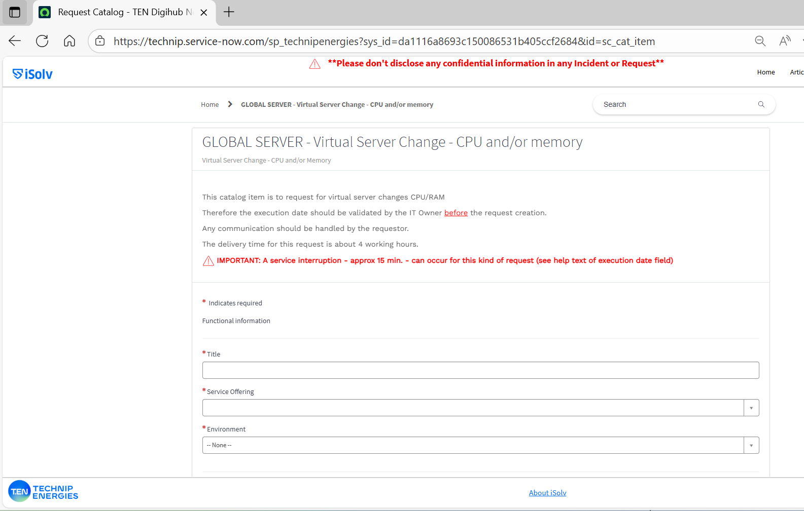
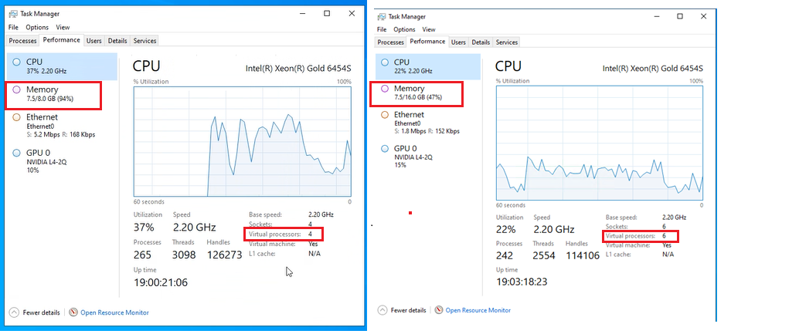

 Miguel Barroso-Casillas · 25/09/2025

## GLOBAL SERVER - Virtual Server Change - CPU and/or memory

Link de ISOLV:     
https://technip.service-now.com/sp_technipenergies?sys_id=da1116a8693c150086531b405ccf2684&id=sc_cat_item

## campos a rellenar:

•	Title: Expand RAM and Cores server Eu003vm1478
•	Service Offering: AVEVA E3D 3.1.7_P_SPAIN_BARCELONA OC
•	Environment: Production
•	Server Name: Eu003vm1478
•	Requested Cores: 2
•	Requested Memory (GB): 8
•	Reason for the change: The number of users working on this project has doubled. Users complain about the slowness, please increase it by 8GB more so it has 16GB and 2 cores more so it has 6 cores. THANK YOU
•	Change performed during regular EDC Maintenance?: No
•	Please provide an execution date/time: 26-09-2025 10:23:43 CEST
•	Comments: If necessary, you can restart the server.
  

  obs: Requested Cores y Requested Memory (GB), es el **incremento**, ver aclaración en Reason for the change

  Preguntas: Miguel (todo informacion proveniente de Amarillo)

  Notas: si el rendimiento del servidor no mejora, existe otra opcion que es pedir un balanceo del servidor (con ortro servidor)

