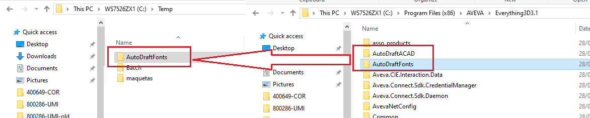
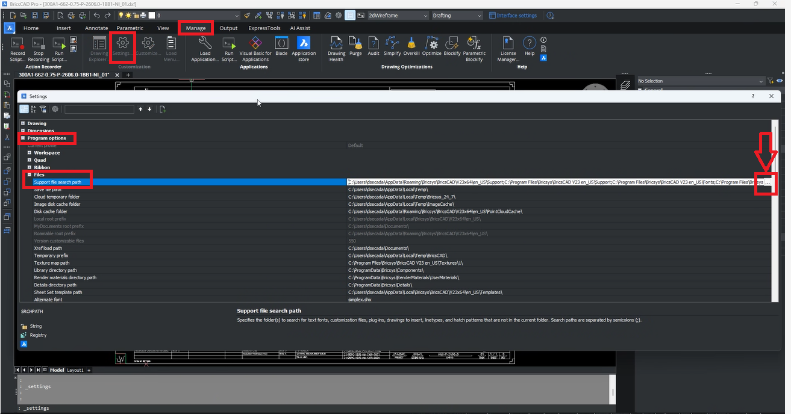
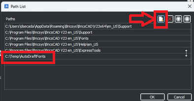

# Issue: Fonts Display Incorrectly in CAD Files Extracted from E3D

## Cause:

When opening a CAD file extracted from E3D (Everything3D) in programs like BricsCAD or AutoCAD, some fonts may appear overlapped or excessively large. This issue arises because E3D uses its own set of fonts, which may not be recognized by other CAD programs.

## Solution:

To resolve this issue, you need to ensure that the fonts used by E3D are accessible to the CAD program you are using. Follow these steps to configure the font paths correctly:

Locate the E3D Font Directory: E3D stores its fonts in specific directories depending on the version. Common directories include:
 C:\AVEVA\Everything3D2.10\AutoDraftFonts

Copy Fonts to a Temporary Directory: If the font directory is not available on your PC or if the fonts are not functioning correctly, copy the fonts to a temporary directory such as C:\Temp.
Example: Copy the contents of C:\Program Files (x86)\AVEVA\Everything3D3.1\AutoDraftFonts to C:\Temp.

  

Configure BricsCAD:
1. Open BricsCAD.
2. Navigate to MANAGE > SETTINGS > PROGRAM OPTIONS > FILES > SUPPORT FILE SEARCH PATH.
     
3. Add the path to the copied fonts directory (C:\Temp) using the '...' icon.
 
4. Close and reopen BricsCAD to apply the changes.

By following these steps, the CAD program should be able to recognize and correctly display the fonts used in the E3D files.

   