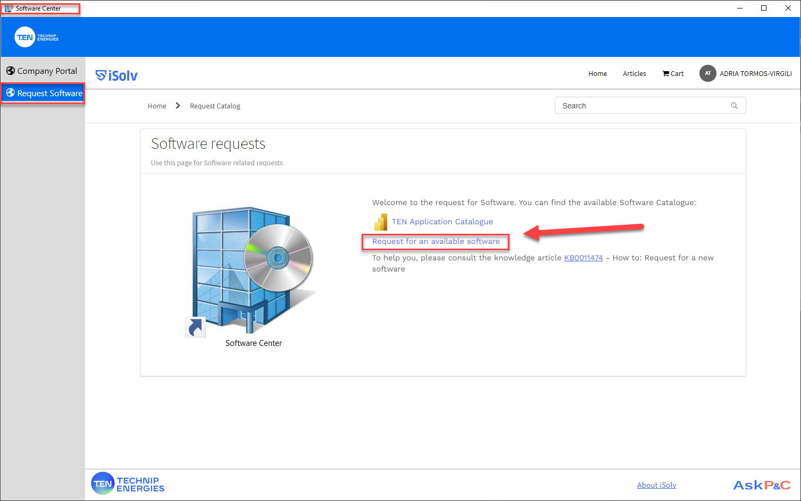

# HOW TO REQUEST EVERITHIG 3D 3.1

([Request Catalog - TEN Digihub New Portal](https://technip.service-now.com/sp_technipenergies?id=sc_cat_item&sys_id=25e52ef91bd5a910e93b41dde54bcb1c))

In the software center:
1. Go to the tab "Request software"
2. Click on "Request fot available software"

We are going to request AVEVA E3D 3.1.7_P_SPAIN_BARCELONA OC how we can see in the image below

Once in the Request Catlogue Window:
1. Serch for E3D
2. Select the second option. the one with the large descripotion that has to be the same of the Aplication Catalogue.
3. We can select the software directly bt typing the RES code **RES0657917**
4. Feel the business Justification with something
5. Click on the **REQUEST** button to request the software

The REQ needs to be aproved by the JS.
One approved you will be able to install the software from the Company Portal

