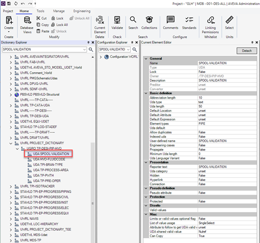

# **CHEQUEO LONGITUD DE TRAMOS DE TUBERÍA MENORES DE 100MM**

### PROBLEMA QUE RESUELVE

Extracción de isométricos con trozos de tubería (TUBI) inferiores a 100mm de longitud entre soldaduras.

<u>**Observaciones**:</u> esto es algo que se debería tener en cuenta a la hora de diseñar una tubería, pero dado que se han emitido isométricas con este problema, se ha desarrollado esta mejora para minimizar estos casos. 

### IMPLEMENTACIÓN

1.	Abrir el directorio del proyecto …/ADMIN\Customization\Pmllib\Design\TPDesPipeExtracts\mac\PreProcess y poner los archivos **“tube.pmlmac”** y **“warningWeld.pmlmac”** que se encuentran en la carpeta files.

2.	Crear una UDA llamada SPOOL-VALIDATION a nivel de PIPE, usar este **[Dblisting](.\files\UDA-SPOOL-VALIDATION.txt)**.

[UDA_DESIGN](.\img\img2.png)

3.	Añadir al archivo **“previewisostd.txt”** las siguientes filas:

Ver archivo de ejemplo **[aquí](.\files\previewisostd.txt)**

### FUNCIONAMIENTO

* **Aviso de tramos de tubería inferiores a 100mm** entre soldaduras como las indicadas en el siguiente dibujo (L1*):

* Cuando se genere el dibujo isométrico si el sistema detecta un caso como el indicado en el ejemplo anterior, extraerá un texto en medio del dibujo con el mensaje: **SHORT SPOOL, CHECK ISOMETRIC** (ver ejemplo)

* Cuando la persona encargada del diseño de esta tubería lo vea, deberá comprobar si los tramos detectados deben revisarse o por el contrario son aceptables.

* Para facilitar esta tarea, en la command window de E3D, aparece un listado con los tramos a revisar como se muestra en la siguiente captura:

* A la misma vez el sistema pintará de color rojo los trozos que deben revisarse/validarse como se ve en la imagen:

* Una vez revisado, se deberá completar el atributo :SPOOL-VALIDATION de la PIPE con las siglas de la persona que lo ha validado (por defecto aparecerá en 'unset').

* Después de validarlo, al generar de nuevo el dibujo isométrico, nos saldrá en la command window lo siguiente:

* Si el nuevo diseño, no tiene tramos menores de 100mm, no aparecerá este listado.

### NOTAS:

* Recordar el fichero init: DFLTS%\TPDesPipeExtracts\TPDesPipeExtracts.ini aqui hay que indicar donde pones los ficheros para el preporceso.
``
[FOLDERS_PREPROCESS_MACRO]
%PMLLIB%\1_Design\TPDesPipeExtracts\mac\PreProcess
``

* es posible que la parte de preprocees este comentada en el form. TPDesPipeExtracts.pmlfrm

``
 !dirPreprocess = object file(!!TPDesPipeExtDefaults.GetFolderPreProcMacro())
    !fileNames = !dirPreprocess.Files()
    !arrPreProcMacro = object array()
        Do !mac values !fileNames
            skip if (!mac.Entry().Matchwild(|*.pmlmac|).eq(FALSE))
        !arrPreProcMacro.Append(!mac)
   EndDo
``

y esta:

!!TPDesPipeExtSesData.SetRunPreProcMacro(!arrPreProcMacro)