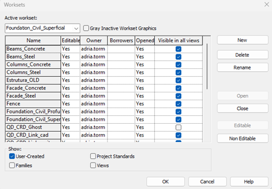
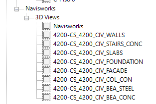
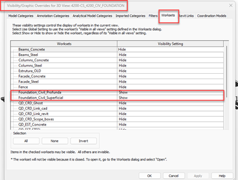
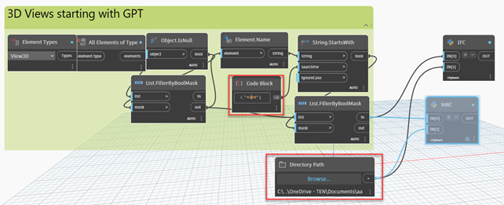

# 🏗️ Cómo Exportar a IFC desde Revit usando Dynamo

---

## 1. Introducción

En este documento se explica un procedimiento práctico para exportar modelos **IFC** desde Revit de forma controlada. La metodología se basa en el uso de **worksets** y **vistas específicas de exportación**, lo que permite decidir qué partes del modelo se incluyen en cada archivo. Además, se detalla cómo aprovechar **Dynamo** para automatizar el proceso y evitar exportaciones manuales una a una.

> **Objetivo:**  
> Proporcionar una guía clara y repetible que facilite generar IFC más ligeros y organizados.

---

## 2. Preparación del Modelo en Revit

Para una exportación organizada es necesario tener el modelo de Revit bien estructurado. Organizaremos el modelo según los tipos de componentes por disciplina, usando los **worksets**.

### 2.1. Worksets

Un **workset** es un contenedor de elementos de Revit, donde agrupamos diferentes tipos de elementos.

**Ventajas de usar worksets:**

- 🗂️ **Separación por disciplinas:** Organiza los elementos según arquitectura, estructura, instalaciones, etc.
- 👁️ **Control de visibilidad:** Permite encender o apagar grupos completos de elementos según el entregable.
- 🧹 **IFC más limpio y ligero:** Exporta solo lo necesario, eliminando información irrelevante.
- 🧩 **Subdivisión del modelo:** Divide el modelo en partes exportables según los requerimientos del proyecto.

**Ejemplo de worksets recomendados:**

- Arquitectura
- Estructura
- Electricidad
- Entorno / Topografía
- Elementos auxiliares (mobiliario, equipos, etc.)

    

Cuando creemos una vista específica para exportar, solo tendremos que decidir qué worksets dejamos visibles.

---

### 2.2. Configuración de Vistas de Exportación

Con los worksets organizados, el siguiente paso es crear las **vistas de exportación**. Estas vistas serán la base para generar los IFC, por lo que deben estar limpias y bien configuradas.

- Si quieres subdividir un modelo grande en varios IFC según los worksets, genera tantas vistas 3D como IFC quieras exportar.
- Las vistas de exportación deben usarse solo para este fin: **no se debería trabajar en ellas**.

    

**Recomendaciones:**

- Usa un **prefijo común** para todas las vistas a exportar (por ejemplo, el área de trabajo).
- El nombre de cada vista será el nombre del archivo IFC generado.
- Configura la visibilidad (VV → Worksets) para mostrar solo los worksets deseados en cada vista.

    

---

## 3. Automatización IFC usando Dynamo

Para agilizar la exportación de los IFC, podemos usar **Dynamo**, una herramienta que permite crear funciones y automatizar tareas dentro de Revit.

    

**¿Cómo funciona?**

1. Recoge todas las vistas 3D del modelo y las filtra por el prefijo definido.
2. Exporta cada una en formato IFC en la ruta establecida.
3. Las opciones de exportación se pueden ajustar dentro del bloque de IFC Export, usando un script en Python.

---

## 4. Modelos Centrales en Revit

En proyectos grandes, normalmente se trabaja con un **modelo central** en Revit, guardado en un servidor o en la nube. Cada usuario trabaja con su copia local.

**Ventajas:**

- Todas las vistas IFC se crean en el modelo central, accesibles para todo el equipo.
- Cada disciplina puede configurar sus propias vistas de exportación sin interferir con las de los demás.
- El control de worksets facilita decidir qué se incluye en cada exportación.
- Dynamo puede ejecutarse desde el modelo central o desde una copia local sincronizada, garantizando condiciones homogéneas.

---

> **Resumen:**  
> El uso de modelos compartidos y worksets no solo organiza el trabajo diario, sino que también permite una exportación a IFC coordinada y consistente para todo el equipo.
