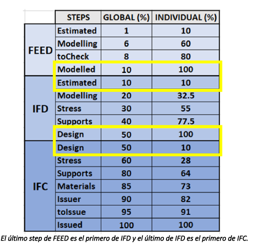

El control de progreso se realiza (actual y en e3d) para EQUIPOS y TUBERÍAS

**TUBERIAS**: Si hay isocontro por isocontrol. Si no usando una UDA. (y probablemente haremos un formulario) Los step son los de la imagen_01

 

obs: ponemos IFC-ISSUED, asi que escribiremos FEED-ISSUED

**EQUIPOS**: Son los siguientes y tienen significado segun el estado del plano con el que se han modelado.

!status=|NOT_STUDIED PDS/TDS MECHANICAL_DRAWING/FIRST_GAD GAD+DETAILED_DW_CODE1 GAD+DETAILED_DW_CODE2 GAD+DETAILED_DW_CODE2_MERGED/CODE3 IFC-100| (separado el especio, ver **assigAttProgress.pmlfrm**)

## TEORÍA:

BASES: STEP + pesos 

Cada step representa 'algo', como el 'grado de detalle con el que ha sido modelado'. El peso es su importancia relativa en el conjunto.

Los step pueden informar de como llevo la cosas, donde poner + recursos y estas cosas que hacen los alemanes. El calculo del avance resulta un numero promediado por los pesos que tendra un significado muy discutible.